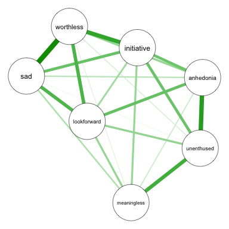
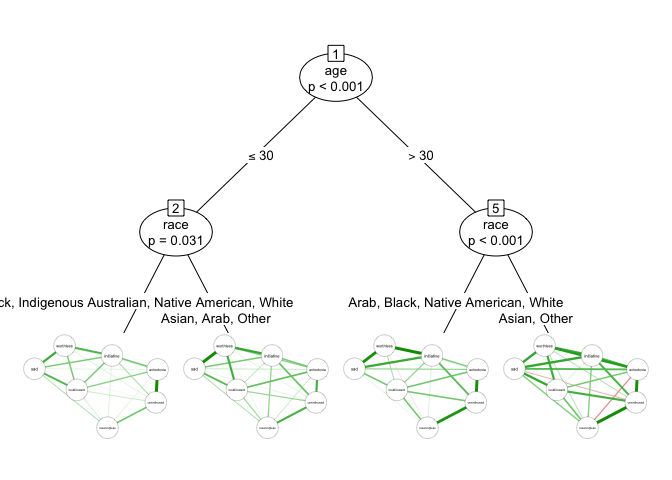

<!-- README.md is generated from README.Rmd. Please edit that file and run rmarkdown::render("README.Rmd") -->

Psychometric networks provide information about the statistical
relationships between observed variables. ***networktree*** is a package
for partitioning psychometric networks to reveal heterogeneity.

Consider a depression network where the nodes represent different
symptoms:

<!-- -->

***networktree*** can be used to identify if this depression network is
heterogeneous depending on the sample characteristics. For instance, we
can test whether the network differs depending on participants’ marital
status.

<!-- -->

We can explore multiple characteristics at once, with the more important
splitting characteristics being prioritized in the tree model.
Continuous partitioning variables (e.g., age) can be included, and
***networktree*** will automatically search for the ideal split
point(s).

<!-- -->

Resources:

  - [Home Page](https://paytonjjones.github.io/networktree/)
  - [Getting Started -
    Tutorial](https://paytonjjones.github.io/networktree/index.html)
  - [CRAN
    documentation](https://cran.r-project.org/web/packages/networktree/index.html)  
  - [Example
    application](https://paytonjjones.github.io/networktree/articles/returns.html)
  - [Published paper](https://rdcu.be/b9Kyw) for a more advanced look.

To cite ***networktree***, use:

Jones, P.J., Mair, P., Simon, T., & Zeileis, A. (2020). Network trees: A
method for recursively partitioning covariance structures.
*Psychometrika*, **85**(4), 926-945.
[doi:10.1007/s11336-020-09731-4](https://doi.org/10.1007/s11336-020-09731-4)
