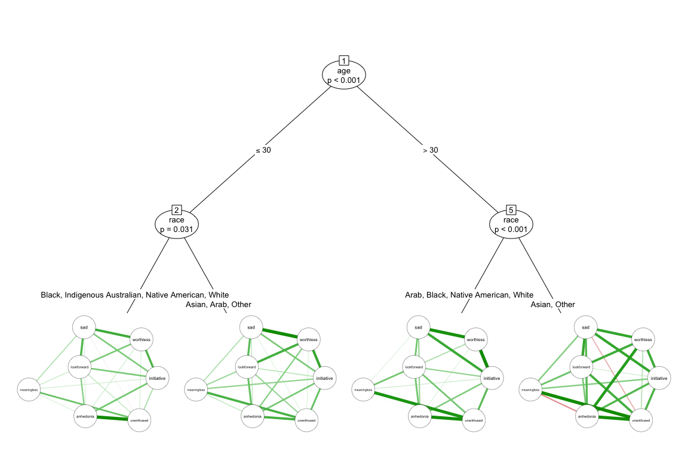

<!-- index.md is generated from index.Rmd. Please edit that file and run rmarkdown::render("index.Rmd") -->

Psychometric networks provide information about the statistical
relationships between observed variables. ***networktree*** is a package
for partitioning psychometric networks to reveal heterogeneity.

***networktree*** can be used to identify if a network is heterogeneous
depending on the sample characteristics.

<!-- -->

Resources:

  - [Getting Started -
    Tutorial](https://paytonjjones.github.io/networktree/index.html)
  - [CRAN
    documentation](https://cran.r-project.org/web/packages/networktree/index.html)  
  - [Example
    application](https://paytonjjones.github.io/networktree/articles/returns.html)
  - [Published paper](https://rdcu.be/b9Kyw) for a more advanced look.

To cite ***networktree***, use:

Jones, P.J., Mair, P., Simon, T., & Zeileis, A. (2020). Network trees: A
method for recursively partitioning covariance structures.
Psychometrika. Advance online publication.
<https://doi.org/10.1007/s11336-020-09731-4>
