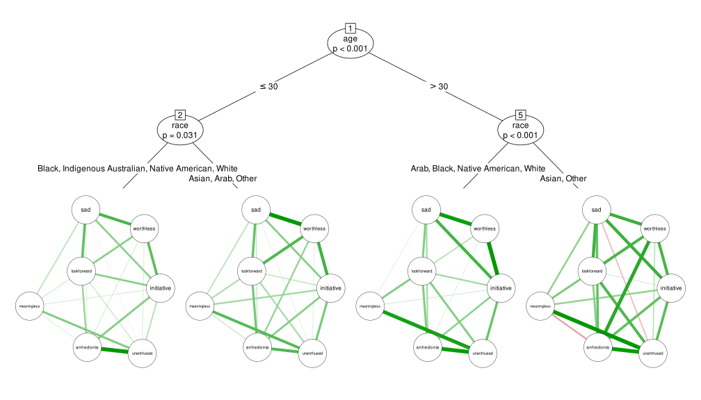

<!-- index.md is generated from index.Rmd. Please edit that file and run rmarkdown::render("index.Rmd") -->

## Network Trees: Recursive Partitioning of Network Models

Correlation-based network models, also known as psychometric networks,
provide information about the statistical relationships between observed
variables. To reveal significant differences in such networks with
respect to covariates, network trees recursively partition the data and
fit separate network models in the resulting subsamples.

The **networktree** package implements two network tree algorithms:
model-based trees based on a multivariate normal model and nonparametric
trees based on covariance structures.

<!-- -->

**Reference:** Jones, P.J., Mair, P., Simon, T., Zeileis, A. (2020).
Network trees: A method for recursively partitioning covariance
structures. *Psychometrika*. **85**(4), 926-945.
[doi:10.1007/s11336-020-09731-4](https://doi.org/10.1007/s11336-020-09731-4)
